# Acceptance Tests: Zoom Plugin for Indico

This document describes the tests a user should perform to verify that all features developed for the Zoom plugin work
correctly.

## Prerequisites

Before running these tests, make sure you have:

- A running Indico instance with the Zoom plugin installed and configured
- Zoom API credentials (Account ID, Client ID, Client Secret) configured in the plugin
- At least **two user accounts** in Indico, each with an email registered in Zoom
- Access to the Indico administration panel (administrator permissions)

---

## 1. Language Interpretation

This feature enables simultaneous interpretation in Zoom meetings and webinars, allowing you to assign interpreters with
their source and target languages.

### 1.1 Enable interpretation from the general settings

**Objective:** Verify that the language interpretation option can be enabled and disabled from the plugin's general
settings.

**Steps:**

1. Log in as an administrator in Indico
2. Go to "Administration" > "Plugins" > "Zoom"
3. Locate the "Zoom Account" section
4. Find the **"Allow Language Interpretation"** option
5. Toggle the switch on (it should appear green/enabled)
6. Click "Save" to save the changes
7. Reload the page and verify the option is still enabled

**Expected result:** The option is saved correctly and persists after reloading the page.

**Reference screenshots:**

| Before                                                      | After                                                     |
|-------------------------------------------------------------|-----------------------------------------------------------|
| 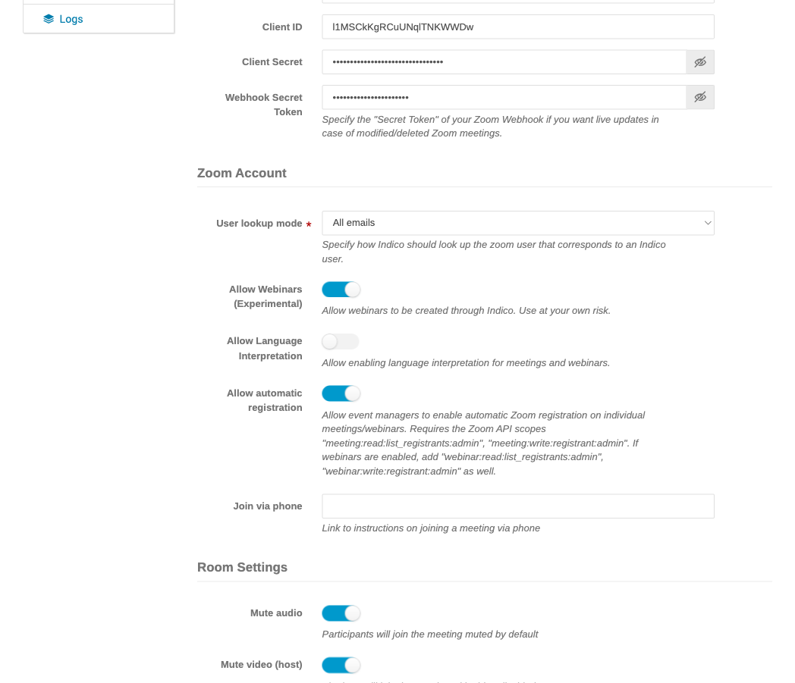 | 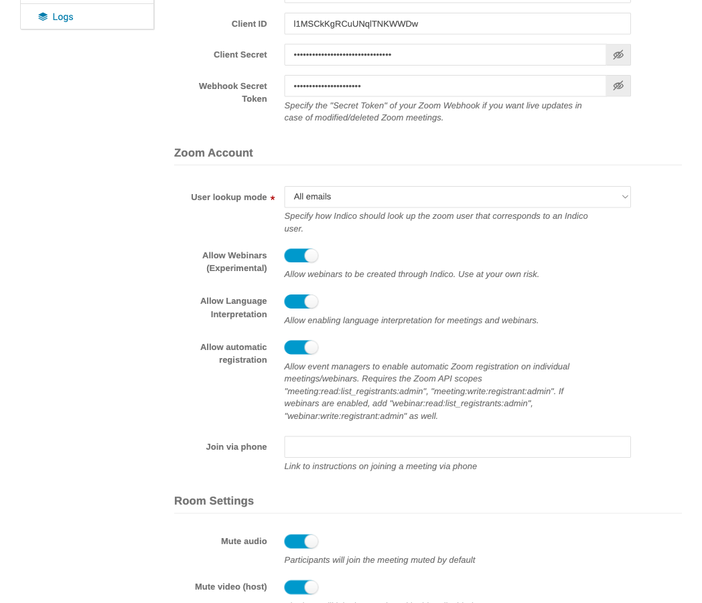 |

### 1.2 Disable interpretation

**Steps:**

1. On the same settings page, toggle off "Allow Language Interpretation"
2. Click "Save"
3. Reload the page

**Expected result:** The option appears disabled after saving and reloading.

### 1.3 Verify the interpretation option appears when creating a meeting

**Prerequisite:** The "Allow Language Interpretation" option must be enabled in the plugin settings.

**Steps:**

1. Go to an existing event or create a new one
2. Navigate to the "Videoconference" section of the event (in the management menu)
3. Click "Create a new Zoom meeting"
4. In the advanced options of the form, look for the **"Language interpretation"** option

**Expected result:** A toggle switch called "Language interpretation" appears within the advanced options of the meeting
creation form.

**Reference screenshots:**

| Form view                                                                  | Advanced settings view                                                         |
|----------------------------------------------------------------------------|--------------------------------------------------------------------------------|
| 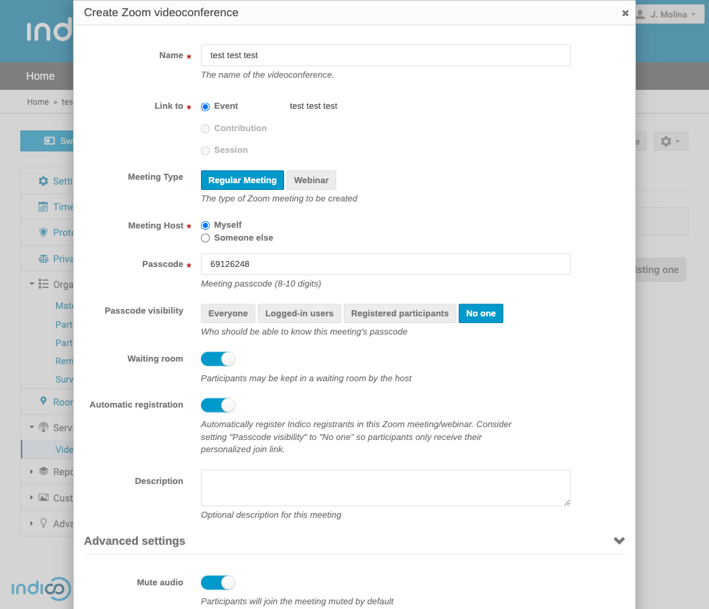    | 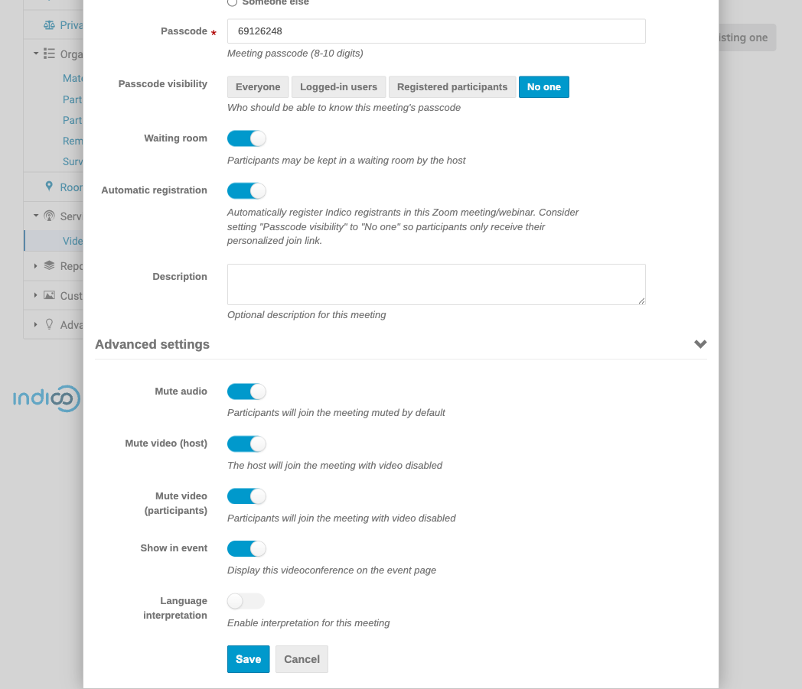 |

### 1.4 Add interpreters to a meeting

**Prerequisite:** Language interpretation must be enabled in the plugin settings.

**Steps:**

1. When creating or editing a Zoom meeting, toggle on "Language interpretation"
2. A table should appear where you can add interpreters
3. Click "Add new row" (or the equivalent button to add a new entry)
4. Fill in the interpreter details:
    - **Email:** the interpreter's email address (must be a valid email)
    - **Source Language:** select the source language (e.g. "English")
    - **Target Language:** select the target language (e.g. "Spanish")
5. Add at least a second interpreter with different languages
6. Save the meeting

**Expected result:**

- The interpreters are saved correctly
- The available languages are: English, Chinese, Japanese, German, French, Russian, Portuguese, Spanish, Korean
- The source and target languages cannot be the same

**Reference screenshots:**

| Before save                                                     | After save                                                              |
|-----------------------------------------------------------------|-------------------------------------------------------------------------|
| 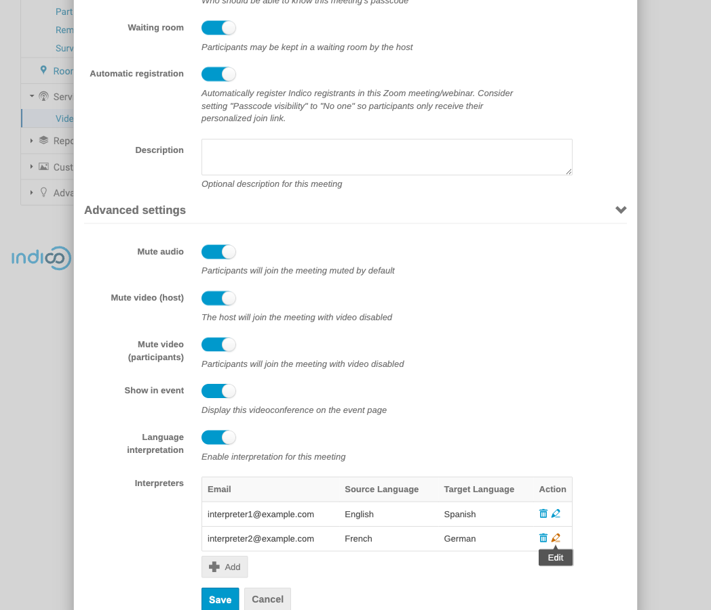          | 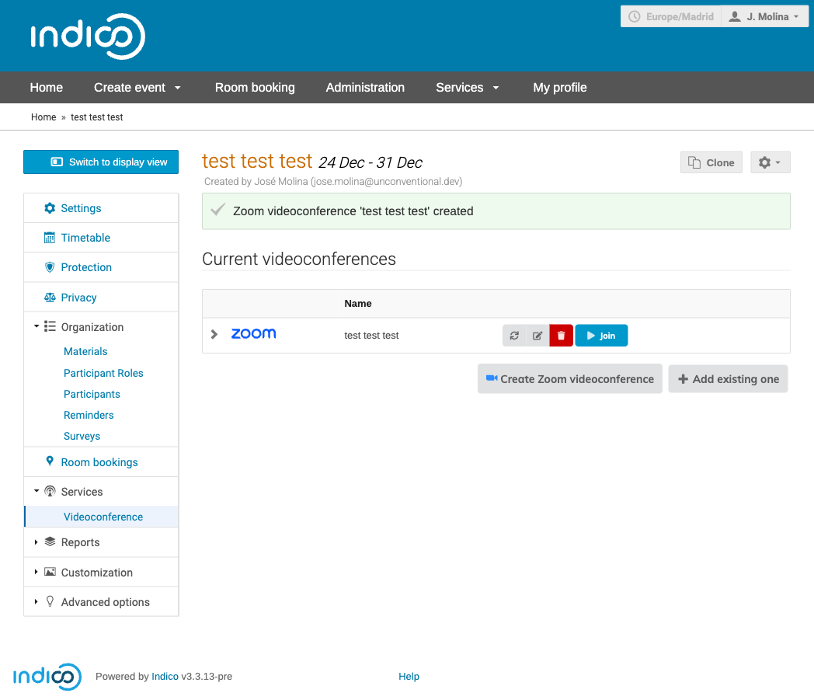    |

### 1.5 Verify that interpreters persist

**Steps:**

1. After saving the meeting with interpreters, close the page
2. Return to the videoconference section of the event
3. Edit the previously created Zoom meeting

**Expected result:** The interpreters added earlier appear in the table with their emails and languages correctly saved.

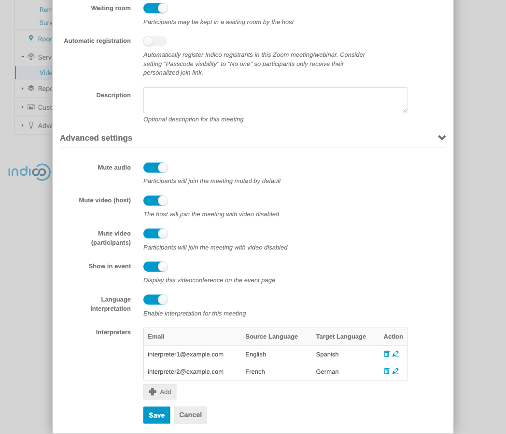

### 1.6 Verify synchronization with Zoom

**Steps:**

1. After saving a meeting with interpreters in Indico, go to [Zoom Meetings](https://zoom.us/meeting#/upcoming)
2. Locate the corresponding meeting in the "Upcoming" tab
3. Click on the meeting title to open its details
4. Scroll down to the **"Interpretation"** section in the meeting details page
5. Verify that "Enabled language interpretation" appears
6. Verify that each interpreter entry shows the correct email and language pair (e.g. "interpreter1@example.com (English ⇄ Spanish)")

**Expected result:** The interpreters and their languages also appear in the meeting settings on Zoom. Changes are
reflected in both directions.

**Reference screenshots:**

| Full Zoom meeting details page                                              | Interpretation section close-up                                          |
|-----------------------------------------------------------------------------|----------------------------------------------------------------------------|
| 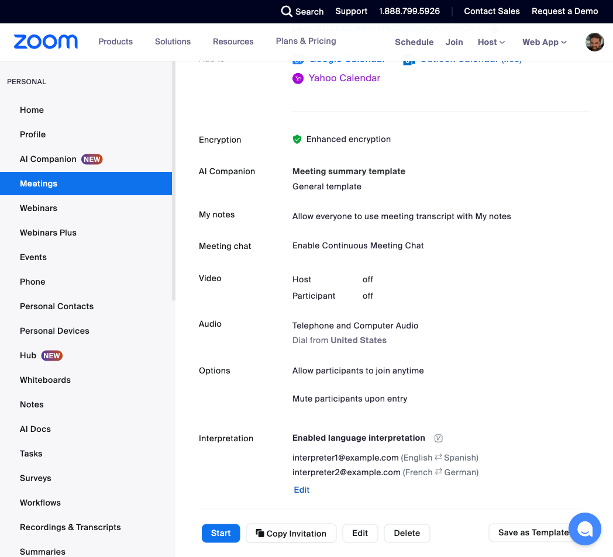 |  |

---

## 2. Automatic Zoom Registration

This feature allows users who register for an Indico event to be automatically registered in the associated Zoom meeting
as well. The user receives a personalized link to join the meeting.

### 2.1 Enable automatic registration from the general settings

**Objective:** Verify that the automatic registration option can be enabled and disabled from the plugin settings.

**Prerequisite:** The Zoom application must have the required scopes configured:

- `meeting:read:list_registrants:admin`
- `meeting:write:registrant:admin`
- (If webinars are used, also: `webinar:read:list_registrants:admin` and `webinar:write:registrant:admin`)

**Steps:**

1. Log in as an administrator in Indico
2. Go to "Administration" > "Plugins" > "Zoom"
3. Locate the "Zoom Account" section
4. Find the **"Allow automatic registration"** option
5. Toggle the switch on
6. Click "Save"

**Expected result:**

- If the Zoom application has the required scopes, the option is saved successfully
- If scopes are missing, an error message appears indicating which ones are missing (e.g. *"The Zoom app is missing the
  required scopes for automatic registration. Please add: ..."*)

**Reference screenshot:**

### 2.2 Disable automatic registration

**Steps:**

1. Toggle off "Allow automatic registration"
2. Click "Save"
3. Reload the page

**Expected result:** The option remains disabled and persists after reloading.

**Reference screenshot:**

### 2.3 Verify the automatic registration option appears when creating a meeting

**Prerequisite:** The "Allow automatic registration" option must be enabled in the plugin settings.

**Steps:**

1. Go to an event that has at least one registration form created
2. Navigate to "Videoconference" and create a new Zoom meeting
3. In the creation form, look for the **"Automatic registration"** option

**Expected result:** A toggle switch called "Automatic registration" appears with the description *"Automatically
register Indico registrants in this Zoom meeting/webinar. Consider setting 'Passcode visibility' to 'No one' so
participants only receive their personalized join link."*

**Reference screenshot:**

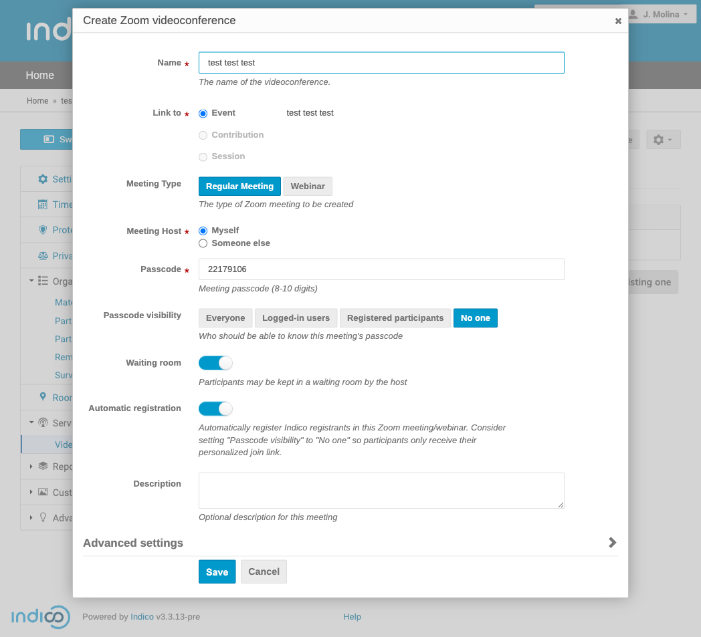

### 2.4 Verify the option does NOT appear if disabled globally

**Steps:**

1. Disable "Allow automatic registration" in the plugin's general settings
2. Go to create a new Zoom meeting in any event
3. Review all options in the form

**Expected result:** The "Automatic registration" option does not appear in the form.

**Reference screenshot:**

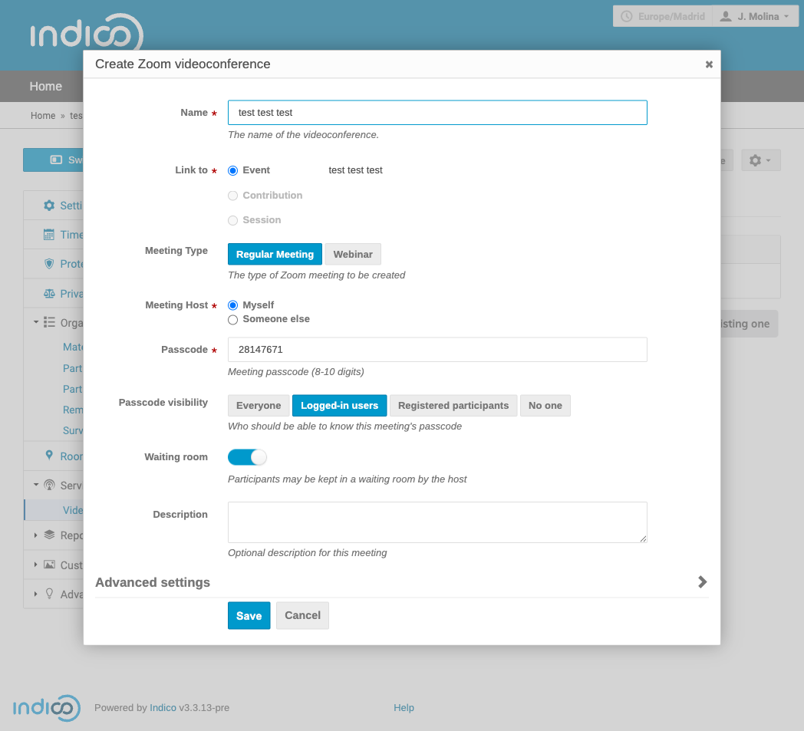

### 2.5 Create a meeting with automatic registration enabled

**Steps:**

1. Make sure "Allow automatic registration" is enabled in the plugin settings
2. Create a new event of type "Conference"
3. Create a registration form for the event
4. Go to "Videoconference" and create a new Zoom meeting
5. Toggle on "Automatic registration"
6. Set "Passcode visibility" to **"No one"** (recommended when using automatic registration)
7. Save the meeting

**Expected result:** The meeting is created successfully. On Zoom, the meeting will have the registration option
enabled (approval type).

**Reference screenshot:**

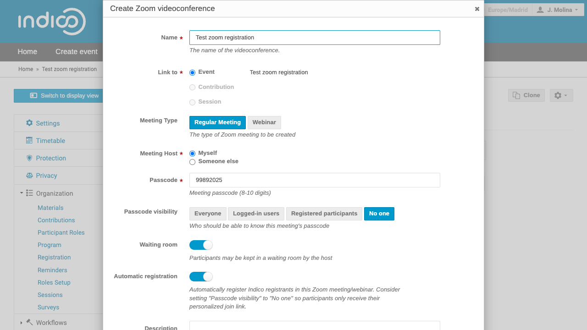

### 2.6 Verify automatic registration of a participant

**Prerequisite:** An event with a Zoom meeting that has automatic registration enabled.

**Steps:**

1. Log in with a second user (non-administrator)
2. Go to the event
3. Register through the event's registration form
4. Complete the registration form and submit it

**Expected result:**

- The Indico registration completes successfully
- The user is automatically registered in the Zoom meeting
- When accessing the event page as this user, they should see a "Join" button with a personalized Zoom link (different
  from the generic meeting link)

**Reference screenshots:**

| Before                                                    | After                                                      |
|-----------------------------------------------------------|------------------------------------------------------------|
| 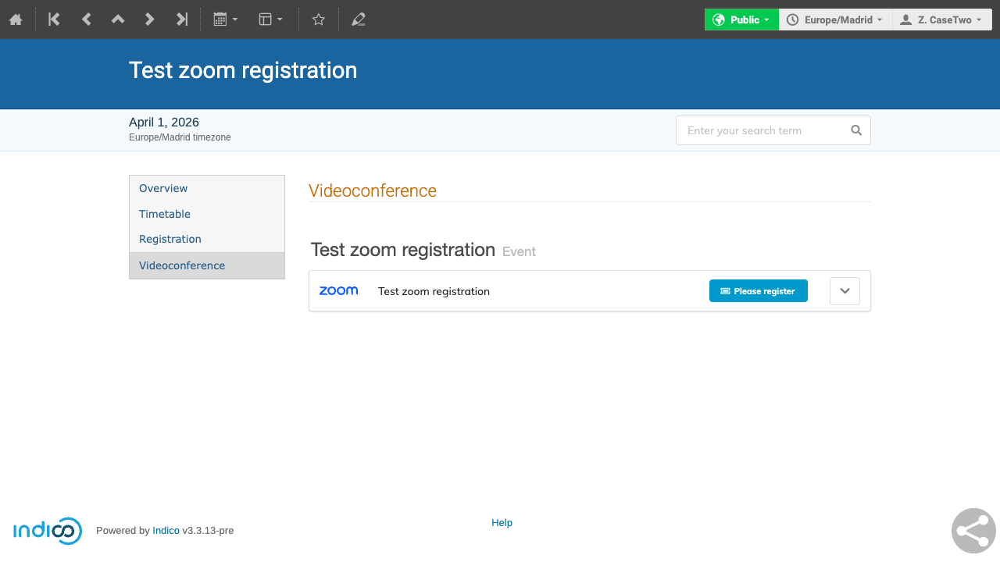 | 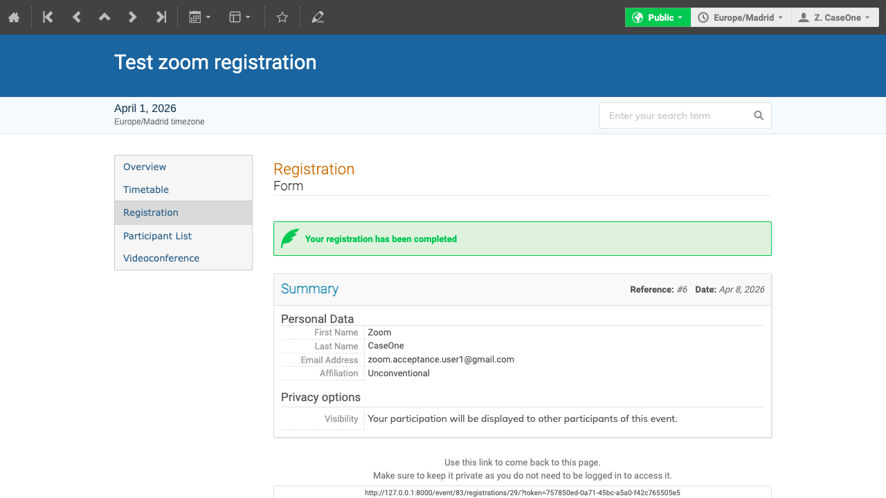 |

### 2.7 Verify the personalized Zoom join link

**Prerequisite:** A user previously registered in an event with automatic registration.

**Steps:**

1. Log in as the user who registered in the previous step
2. Go to the event page
3. Observe the "Join" button next to the Zoom meeting

**Expected result:** The "Join" button leads to a personalized Zoom link (a URL containing a unique token for the
registered user), not the generic meeting link.

**Reference screenshot:**

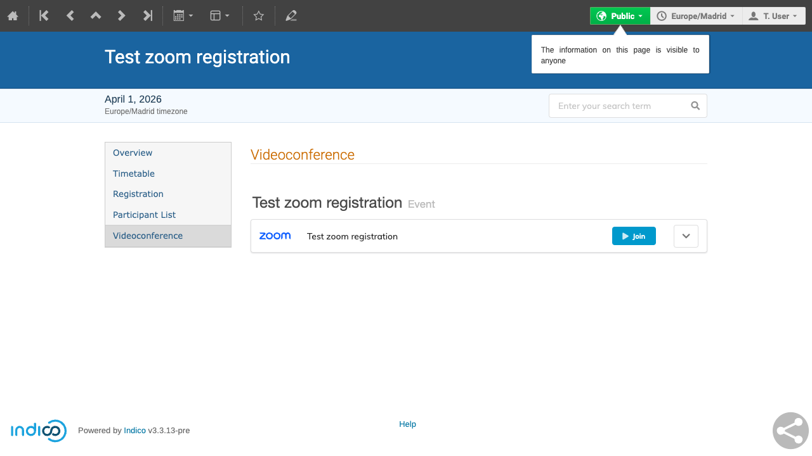

### 2.8 Verify passcode visibility based on configuration

Passcode visibility has four options. Verify each one:

| Option                      | Expected behavior                                                           |
|-----------------------------|-----------------------------------------------------------------------------|
| **Everyone**                | All visitors see the passcode and the full join link                        |
| **Logged-in users**         | Only logged-in users see the passcode                                       |
| **Registered participants** | Only users registered for the event see the passcode                        |
| **No one**                  | Nobody sees the passcode; registered users see their personalized join link |

**Steps for each option:**

1. Edit the Zoom meeting and change "Passcode visibility" to the desired option
2. Save
3. Access the event page as an anonymous user, as a logged-in user (not registered), and as a registered user
4. Observe what information is displayed in each case

**Expected result:** The behavior matches the table above.

**Reference screenshots:**

| Everyone / anonymous                                            | Logged-in users / non-registered user                                  |
|-----------------------------------------------------------------|-------------------------------------------------------------------------|
| 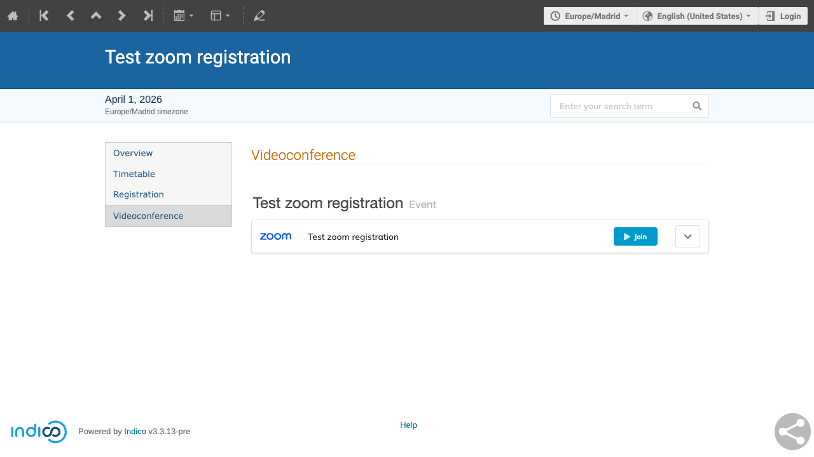 | 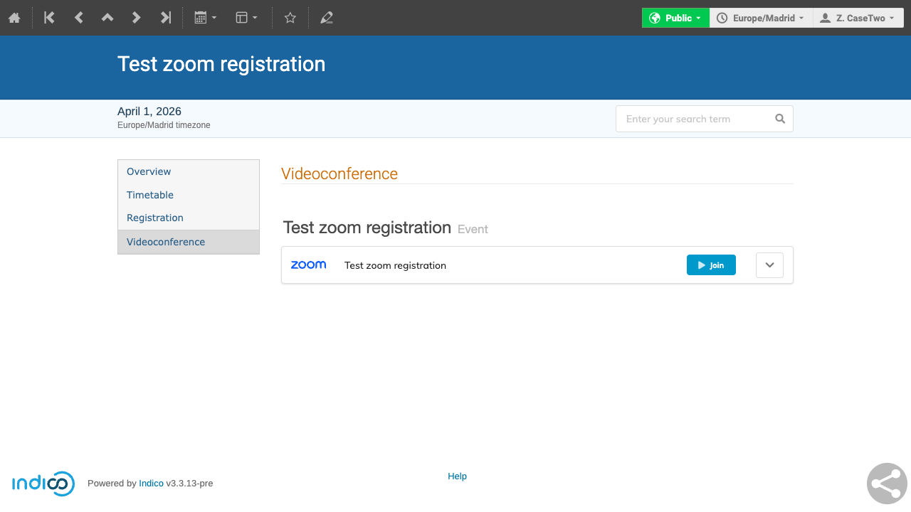 |

| No one / anonymous                                               | No one / registered participant                                         |
|------------------------------------------------------------------|-------------------------------------------------------------------------|
| 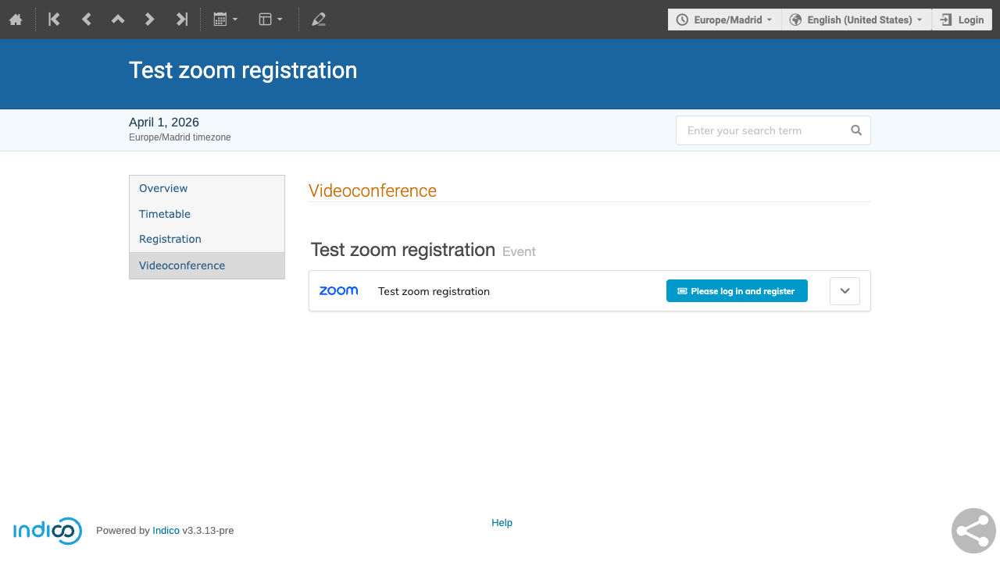      |  |

### 2.9 Verify registration is cancelled upon withdrawal

**Steps:**

1. A registered user withdraws their registration from the event (or an administrator cancels it)
2. Check on Zoom that the user's registration in the meeting has been cancelled

**Expected result:** The user no longer appears as registered in the Zoom meeting.

**Reference screenshots:**

| Before withdrawal                                               | After withdrawal                                                          |
|-----------------------------------------------------------------|---------------------------------------------------------------------------|
|  |  |

### 2.10 Verify existing registrations are synced when creating the meeting

**Steps:**

1. Create an event with a registration form
2. Register several users in the event
3. Now create a Zoom meeting with "Automatic registration" enabled

**Expected result:** All users who were already registered in the event are automatically registered in the newly
created Zoom meeting.

### 2.11 Verify clone protection

When an event has a Zoom meeting with automatic registration, the meeting should not be cloned when cloning the event.

**Steps:**

1. Create an event with a Zoom meeting that has automatic registration enabled
2. Clone the event (Event Actions > Clone)
3. Observe the warnings during the cloning process

**Expected result:** A warning message appears indicating that the meeting cannot be attached to the new event because
it uses Zoom registration. The cloned event will not have the Zoom meeting.

**Reference screenshot:**

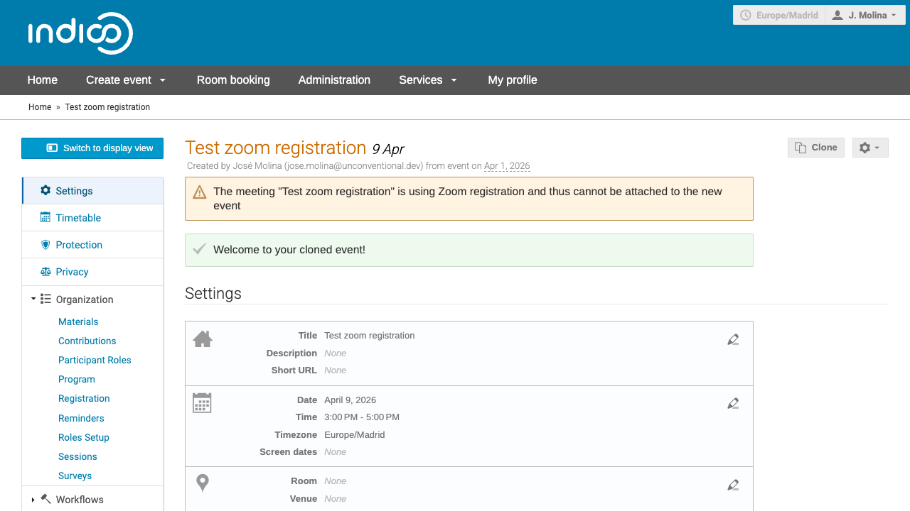

### 2.12 Verify protection against attaching the meeting to another event

**Steps:**

1. Create a Zoom meeting with automatic registration in an event
2. In a different event, try to attach that same existing Zoom meeting

**Expected result:** An error message appears indicating that the meeting uses Zoom registration and cannot be attached
to another event.

**Reference screenshot:**

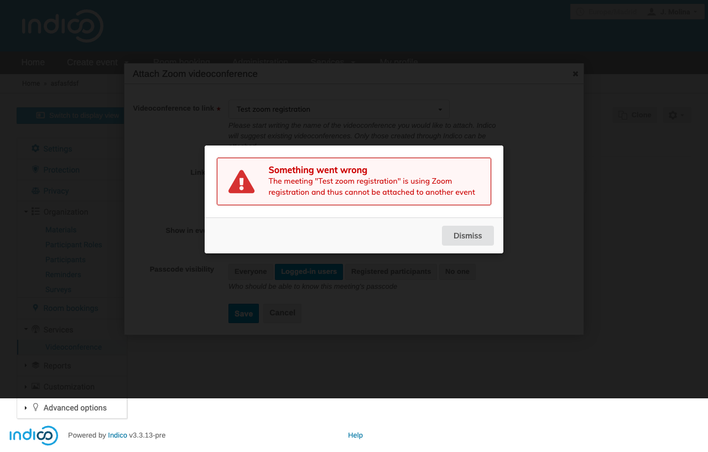

---

## 3. Simultaneous Zoom Meetings with Different Hosts

This section verifies that it is possible to have two Zoom meetings running at the same time, as long as each meeting
has a different host (a different Zoom user as organizer).

### 3.1 Preparation

**Prerequisites:**

- Two users in Indico, each with an email associated with a valid Zoom account (i.e. both emails must be registered in
  Zoom)
- Both users must have permissions to manage events in Indico

We will refer to these users as **User A** and **User B**.

### 3.2 Create two simultaneous events with different hosts

**Steps:**

1. Log in as **User A**
2. Create an event (e.g. "Test Meeting A") with a specific start and end time (e.g. today at 3:00 PM - 4:00 PM)
3. Go to "Videoconference" and create a new Zoom meeting
4. Under "Meeting Host", select **"Myself"** (so that User A is the host)
5. Save the meeting
6. Note down the generated Zoom link

7. Log in as **User B** (or use a different browser window)
8. Create another event (e.g. "Test Meeting B") **at exactly the same time** (3:00 PM - 4:00 PM)
9. Go to "Videoconference" and create a new Zoom meeting
10. Under "Meeting Host", select **"Myself"** (so that User B is the host)
11. Save the meeting
12. Note down the generated Zoom link

**Expected result:** Both meetings are created successfully, each with a different host.

### 3.3 Verify both meetings are accessible simultaneously

**Steps:**

1. When the scheduled time arrives, open the Zoom link for "Test Meeting A"
2. In another browser or device, open the Zoom link for "Test Meeting B"
3. Verify that both Zoom rooms are active and you can join both

**Expected result:** Both meetings work at the same time without issues. Each one has its own host and they are
independent meetings on Zoom.

### 3.4 Verify the same host CANNOT have two simultaneous meetings

**Steps:**

1. Log in as **User A**
2. Create an event with a Zoom meeting where the host is User A (time: 5:00 PM - 6:00 PM)
3. Create another event with another Zoom meeting where the host is also User A (same time: 5:00 PM - 6:00 PM)
4. Try to start both meetings at the same time

**Expected result:** Only one of the meetings can be active at a time with the same host. Zoom does not allow the same
user to host two meetings simultaneously. This confirms that having simultaneous meetings requires using different
hosts.

### 3.5 Create a meeting with a host different from the creator

**Steps:**

1. Log in as **User A**
2. Create a new event
3. Go to "Videoconference" and create a new Zoom meeting
4. Under "Meeting Host", select **"Someone else"**
5. Search for and select **User B**
6. Save the meeting

**Expected result:**

- The meeting is created successfully
- The meeting host on Zoom is User B (not User A who created the meeting in Indico)
- This allows User A to have their own meeting running in parallel

### 3.6 Verify host information on the event page

**Steps:**

1. Go to the public event page
2. Click on the Zoom meeting name or the information button

**Expected result:** The meeting information box displays the host's name and, if applicable, the alternative hosts ("
Alternative hosts").
